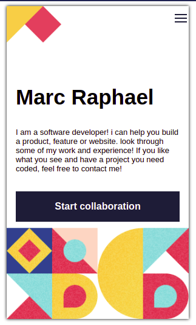
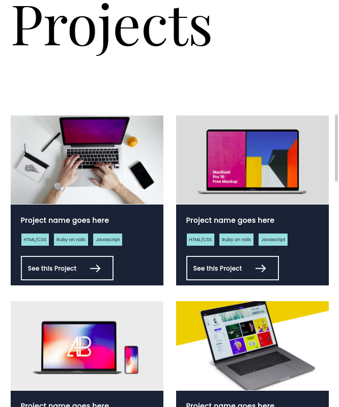

# Marc Raphael's Portofolio

>Welcome to my Portofolio, with three main versions (mobile, tablette, and desktop) as you can see in the screenshots below.

  

in this portofolio you will see all the projects that I have already done, with various programming languages such as: JavaScript, HTML & CSS, Ruby ... etc. I hope you will be satisfied with the work accomplished!

## Built With

- Major languages : HTML/CSS;
- IDE : VisualStudio Code;
- Web Browsers : Firefox, Google Chrome;

### Testing

- Microverse Linters
- [W3C validator](https://validator.w3.org/)

## Getting Started

To get a local copy up and running follow these simple example steps.

### Prerequisites

- Web browser (choose what you prefered)
- Code editor **for developers only

### Setup 

- Download the repo, if you don't know how to do it, just [click here](https://github.com/Marcraphael12/Marc-Raphael-Portofolio/archive/refs/heads/main.zip)!
- Open the index file with your browser, and enjoy!

### Install

- No need to install something!

## Live Demo

[Have a detailed view by clicking here](https://marcraphael12.github.io/Marc-Raphael-Portofolio/)

### Author
👤 **Marc Raphael**

- GitHub: [@Marcraphael12](https://github.com/Marcraphael12)
- LinkedIn: [Marc_Raphael](www.linkedin.com/in/marc-raphael-326039204)

## 🤝 Contributing

Contributions, issues, and feature requests are welcome!

Feel free to check the [issues page](https://github.com/Marcraphael12/Marc-Raphael-Portofolio/issues).

## Show your support

Give a ⭐️ if you like this project!

## Acknowledgments
- [@Figma](https://www.Figma.com) for the template
- [@m05e5](https://github.com/m05e5) for the Form squeletton
- [@Akhtar-joomun](https://github.com/Akhtar-Joomun) for the header animations
